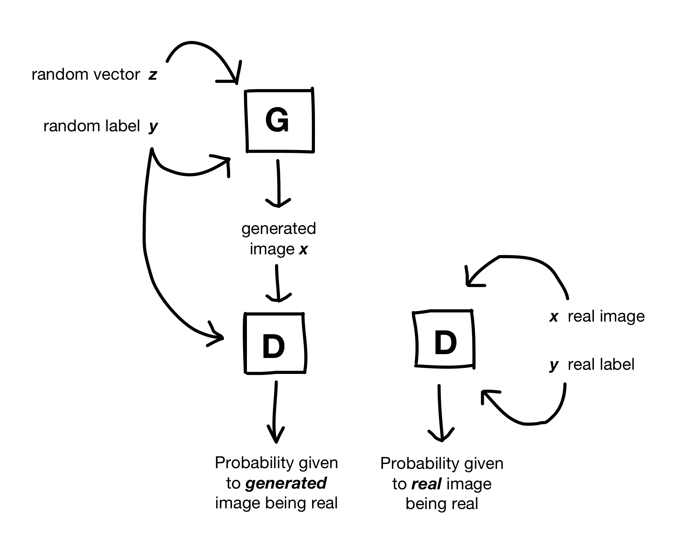

# Conditional DCGAN for MNIST

This is a generative model for the hand-written digits of the MNIST dataset. It combines the DCGAN architecture recommended by [Unsupervised Representation Learning with Deep Convolutional Generative Adversarial Networks (Radford et al)](https://arxiv.org/pdf/1511.06434.pdf) with the inputting of labels suggested in [Conditional Generative Adversarial Nets (Mirza)](https://arxiv.org/pdf/1411.1784.pdf).

## Why a Conditional GAN?

In my [last project](https://github.com/sarahwolf32/DCGAN-for-MNIST), I used a DCGAN to generate MNIST digits in an unsupervised fashion - although MNIST is a labeled dataset, I threw away the labels at the beginning and did not use them. This worked, but of course those labels held a great deal of useful information. It would have been nice to allow the GAN to benefit from that additional input, and it would have also been nice to be able to specify which digit I wanted the trained generator to create. 

Conditional GANs tackle these shortcomings by feeding the labels into both the Generator and Discriminator. 

<p align="center"></p>

This has a couple of effects. For example, in the unsupervised DCGAN, the random vector <i>z</i> input controlled everything about the resulting digit - including which digit it was. Since that role is taken over by the labels in a conditional GAN, the <i>z</i> input here encodes all the <i>other</i> features (rotation, style, and so on). 

Feeding in the labels also affected training. I found that the architecture that had worked in my last project quickly suffered from mode collapse when I used the corresponding version here. Apparently, the labels made it easier for the Discriminator to do its job, allowing the Discriminator to "win" the minimax game prematurely. The generator lost the gradients it needed to learn and started outputting identical black images. 

Using fewer layers and larger filters stabilized training. See ```trainer/architecture.py``` for details.

## Results

Once I used a suitable architecture, the cDCGAN converged relatively quickly. Below are four randomly sampled digits from each category (0 - 9) that were generated by the finished model:


## Trained Model

To use:

1. Download the trained model [here](https://storage.googleapis.com/gan-training-207705-public-bucket/MNIST-cDCGAN-model-1.zip).

2. Unzip it and drag into the ```trainer``` folder.

3. Navigate into the project directory, and run ```python -m trainer.task --sample [NUM_SAMPLES_PER_CLASS]```. The results will be saved to the ```trainer/samples``` folder by default.

## Acknowledgements

* [Unsupervised Representation Learning with Deep Convolutional Generative Adversarial Networks](https://arxiv.org/pdf/1511.06434.pdf)

* [Conditional Generative Adversarial Nets (Mirza)](https://arxiv.org/pdf/1411.1784.pdf)


